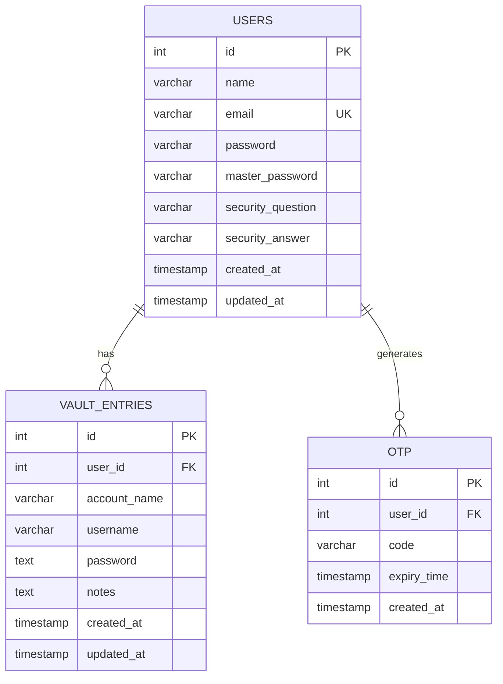

+# Entity Relationship Diagram (ERD)

## Database Schema Overview

This document describes the database schema for the RevPassword Manager application.

## Entities and Relationships

### 1. Users Table

**Purpose**: Stores user account information and authentication credentials

| Column Name        | Data Type     | Constraints                    | Description                          |
|-------------------|---------------|--------------------------------|--------------------------------------|
| id                | INT           | PRIMARY KEY, AUTO_INCREMENT    | Unique user identifier               |
| name              | VARCHAR(100)  | NOT NULL                       | User's full name                     |
| email             | VARCHAR(100)  | UNIQUE, NOT NULL               | User's email (login identifier)      |
| password          | VARCHAR(255)  | NOT NULL                       | Hashed login password (BCrypt)       |
| master_password   | VARCHAR(255)  | NOT NULL                       | Hashed master password (BCrypt)      |
| security_question | VARCHAR(255)  | NOT NULL                       | Security question for recovery       |
| security_answer   | VARCHAR(255)  | NOT NULL                       | Hashed security answer (BCrypt)      |
| created_at        | TIMESTAMP     | DEFAULT CURRENT_TIMESTAMP      | Account creation timestamp           |
| updated_at        | TIMESTAMP     | DEFAULT CURRENT_TIMESTAMP ON UPDATE | Last update timestamp        |

**Indexes**:
- PRIMARY KEY on `id`
- UNIQUE INDEX on `email`

---

### 2. Vault Entries Table

**Purpose**: Stores encrypted password entries for each user

| Column Name   | Data Type     | Constraints                              | Description                          |
|--------------|---------------|------------------------------------------|--------------------------------------|
| id           | INT           | PRIMARY KEY, AUTO_INCREMENT              | Unique entry identifier              |
| user_id      | INT           | FOREIGN KEY, NOT NULL                    | Reference to users.id                |
| account_name | VARCHAR(100)  | NOT NULL                                 | Name of the account (e.g., Gmail)    |
| username     | VARCHAR(100)  | NULL                                     | Username/email for the account       |
| password     | TEXT          | NOT NULL                                 | Encrypted password (AES)             |
| notes        | TEXT          | NULL                                     | Optional notes for the entry         |
| created_at   | TIMESTAMP     | DEFAULT CURRENT_TIMESTAMP                | Entry creation timestamp             |
| updated_at   | TIMESTAMP     | DEFAULT CURRENT_TIMESTAMP ON UPDATE      | Last update timestamp                |

**Indexes**:
- PRIMARY KEY on `id`
- FOREIGN KEY `user_id` REFERENCES `users(id)` ON DELETE CASCADE
- UNIQUE INDEX on `(user_id, account_name)` - ensures one entry per account per user

---

### 3. OTP (One-Time Password) Table

**Purpose**: Stores temporary verification codes for sensitive operations

| Column Name  | Data Type     | Constraints                    | Description                          |
|-------------|---------------|--------------------------------|--------------------------------------|
| id          | INT           | PRIMARY KEY, AUTO_INCREMENT    | Unique OTP identifier                |
| user_id     | INT           | FOREIGN KEY, NOT NULL          | Reference to users.id                |
| code        | VARCHAR(10)   | NOT NULL                       | 6-digit OTP code                     |
| expiry_time | TIMESTAMP     | NOT NULL                       | OTP expiration time (5 min validity) |
| created_at  | TIMESTAMP     | DEFAULT CURRENT_TIMESTAMP      | OTP creation timestamp               |

**Indexes**:
- PRIMARY KEY on `id`
- FOREIGN KEY `user_id` REFERENCES `users(id)` ON DELETE CASCADE

---

## Relationships

### One-to-Many: Users → Vault Entries
- **Type**: One-to-Many
- **Description**: One user can have multiple vault entries
- **Cardinality**: 1:N
- **Foreign Key**: `vault_entries.user_id` → `users.id`
- **On Delete**: CASCADE (deleting a user deletes all their vault entries)

### One-to-Many: Users → OTP
- **Type**: One-to-Many
- **Description**: One user can have multiple OTPs (though typically only one active)
- **Cardinality**: 1:N
- **Foreign Key**: `otp.user_id` → `users.id`
- **On Delete**: CASCADE (deleting a user deletes all their OTPs)

---

## ERD Diagram (Text Representation)

```
┌─────────────────────────────────────┐
│            USERS                     │
├─────────────────────────────────────┤
│ PK  id (INT)                        │
│     name (VARCHAR)                   │
│ UK  email (VARCHAR)                  │
│     password (VARCHAR)               │
│     master_password (VARCHAR)        │
│     security_question (VARCHAR)      │
│     security_answer (VARCHAR)        │
│     created_at (TIMESTAMP)           │
│     updated_at (TIMESTAMP)           │
└─────────────────────────────────────┘
         │                    │
         │ 1:N                │ 1:N
         ▼                    ▼
┌─────────────────────┐  ┌─────────────────────┐
│  VAULT_ENTRIES      │  │       OTP           │
├─────────────────────┤  ├─────────────────────┤
│ PK  id              │  │ PK  id              │
│ FK  user_id         │  │ FK  user_id         │
│     account_name    │  │     code            │
│     username        │  │     expiry_time     │
│     password (enc)  │  │     created_at      │
│     notes           │  │                     │
│     created_at      │  │                     │
│     updated_at      │  │                     │
└─────────────────────┘  └─────────────────────┘
```

---

## Visual ERD Diagram



---

## Business Rules

1. **User Email Uniqueness**: Each user must have a unique email address (enforced by UNIQUE constraint)

2. **Account Name Uniqueness Per User**: A user cannot have two vault entries with the same account name (enforced by UNIQUE constraint on user_id + account_name)

3. **Cascade Delete**: When a user is deleted, all their vault entries and OTPs are automatically deleted

4. **Password Security**:
   - User passwords are hashed using BCrypt before storage
   - Master passwords are hashed using BCrypt before storage
   - Vault entry passwords are encrypted using AES with the user's master password as the key

5. **OTP Validity**: OTPs expire 5 minutes after creation

6. **Single-Use OTPs**: Once verified, OTPs are deleted from the database

---

## SQL DDL Statements

```sql
-- Create Users Table
CREATE TABLE IF NOT EXISTS users (
    id INT AUTO_INCREMENT PRIMARY KEY,
    name VARCHAR(100) NOT NULL,
    email VARCHAR(100) UNIQUE NOT NULL,
    password VARCHAR(255) NOT NULL,
    master_password VARCHAR(255) NOT NULL,
    security_question VARCHAR(255) NOT NULL,
    security_answer VARCHAR(255) NOT NULL,
    created_at TIMESTAMP DEFAULT CURRENT_TIMESTAMP,
    updated_at TIMESTAMP DEFAULT CURRENT_TIMESTAMP ON UPDATE CURRENT_TIMESTAMP
);

-- Create Vault Entries Table
CREATE TABLE IF NOT EXISTS vault_entries (
    id INT AUTO_INCREMENT PRIMARY KEY,
    user_id INT NOT NULL,
    account_name VARCHAR(100) NOT NULL,
    username VARCHAR(100),
    password TEXT NOT NULL,
    notes TEXT,
    created_at TIMESTAMP DEFAULT CURRENT_TIMESTAMP,
    updated_at TIMESTAMP DEFAULT CURRENT_TIMESTAMP ON UPDATE CURRENT_TIMESTAMP,
    FOREIGN KEY (user_id) REFERENCES users(id) ON DELETE CASCADE,
    UNIQUE KEY unique_user_account (user_id, account_name)
);

-- Create OTP Table
CREATE TABLE IF NOT EXISTS otp (
    id INT AUTO_INCREMENT PRIMARY KEY,
    user_id INT NOT NULL,
    code VARCHAR(10) NOT NULL,
    expiry_time TIMESTAMP NOT NULL,
    created_at TIMESTAMP DEFAULT CURRENT_TIMESTAMP,
    FOREIGN KEY (user_id) REFERENCES users(id) ON DELETE CASCADE
);
```

---

## Sample Data

```sql
-- Sample User
INSERT INTO users (name, email, password, master_password, security_question, security_answer)
VALUES ('John Doe', 'john@example.com', 
        '$2a$12$hashednamepassword', '$2a$12$hashedmasterpassword',
        'What is your pet name?', '$2a$12$hashedanswer');

-- Sample Vault Entry
INSERT INTO vault_entries (user_id, account_name, username, password, notes)
VALUES (1, 'Gmail', 'john@gmail.com', 'encryptedpasswordhere', 'Personal email');

-- Sample OTP
INSERT INTO otp (user_id, code, expiry_time)
VALUES (1, '123456', DATE_ADD(NOW(), INTERVAL 5 MINUTE));
```

---

## Database Normalization

The database follows **Third Normal Form (3NF)**:

1. **1NF**: All columns contain atomic values
2. **2NF**: No partial dependencies (all non-key attributes depend on the entire primary key)
3. **3NF**: No transitive dependencies (all non-key attributes depend only on the primary key)

---

## Future Considerations

1. **Password History**: Track password changes over time
2. **Shared Passwords**: Allow password sharing between users
3. **Categories**: Group vault entries by categories
4. **Tags**: Multiple tags per vault entry
5. **Audit Log**: Track all user activities
6. **Two-Factor Authentication**: Additional security layer
